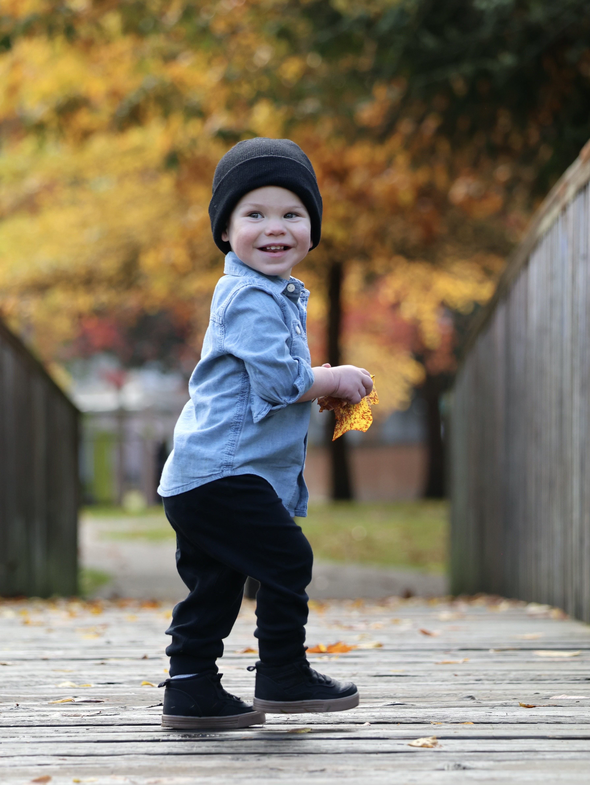

# 🌟 Help Owen Find His Superhero—A Kidney Donor 🌟
Meet Owen, our brave little warrior who was born with End Stage Renal Disease. At just 18 months old, he’s already faced incredible challenges and multiple surgeries and treatments. Through it all, Owen has shown remarkable strength and resilience, but now he’s ready for the next step: a life-saving kidney transplant.

The only thing missing is his superhero—a donor who can give him the gift of life. We are in a critical moment trying to find a kidney for him and we are asking for your help.

## Could you be Owen’s hero?

We are urgently searching for a living kidney donor. Potential donors should be healthy individuals between the ages of 21 and 55. If you, or someone you know, would consider this incredible act of generosity, we’d love to hear from you.

Here’s how you can make a difference:

🔹 Learn more about becoming a donor and how you can save Owen’s life.

🔹 Share Owen’s story—every share helps spread the word and brings us closer to finding his match.

If you're interested in learning more or contacting us, please email us at babyowenneedsakidney@gmail.com.

Together, we can help our little boy find the superhero he desperately needs. Whether through donating, sharing, or simply spreading the word, your support means everything to us.

With love and gratitude,

Kristen and Dallas

___

## Owen's Stay In The NICU

At 32 weeks pregnant, an ultrasound revealed that both of Owen's kidneys were very small and underdeveloped. Just a few weeks later, Owen was born critically ill with kidney failure and spent several weeks in the NICU. At just 1 week old he had surgery to have a peritoneal catheter placed in his abdomen and at 3 weeks he began dialysis. During his stay in the NICU he required around the clock monitoring, daily blood draws, and a feeding tube to help him eat. 

## Dialysis

 

This was Owen’s peritoneal dialysis machine - a machine he needed to be on for 10+ hours a day to treat his kidney failure. In order to remove waste from his blood, cleansing fluid would cycle in and out of his belly through an abdominal catheter. This catheter, which was surgically placed when he was just 1 week old, was a very serious infection risk and the site had to be cleaned and changed everyday. 

While Owen was on dialysis, he had complications that led to additional surgeries and needed to stop dialysis. During that time we discovered that he had gained just enough kidney function to remain off dialysis. As he waits for a transplant, Owen’s kidney function is decreasing and he may have to go back on dialysis soon, which would mean yet another surgery. To avoid this, Owen needs to find a kidney donor as soon as possible. 

## "Owen" means Warrior

 

‘Owen’ means young warrior, and that is exactly who he is. His strength and resilience amaze us as he endures the challenges of living with kidney failure, but even warriors need superheroes. And for Owen, that superhero is a kidney donor. 

Please share Owen’s story and if you are interested in learning more about being a donor for Owen, please email
BabyOwenNeedsAKidney@gmail.com